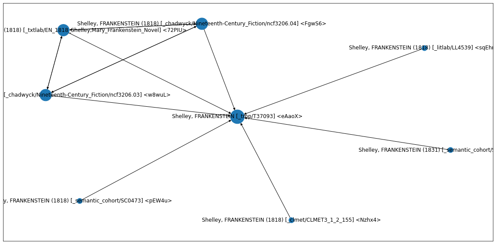

# txtuality

Code, data, and models to examine cultural production. Rooted in the digital humanities, the package assists in corpus management, text analysis, and machine learning.

Install: 
```
pip install txtuality
```

## Texts


```python
# import
from txtuality import Text
```

### Finding existing texts


```python
austen = Text.find(author="Jane Austen")
austen
```


    TextList([Austen, LADY SUSAN IN THE WORKS OF JANE AUSTEN VOLUME VI M (1794) [_semantic_cohort/SC0112] <bh3hB>
              Austen, LADY SUSAN (1794) [_litlab/LL1792] <EILgo>
              Austen, THE WATSONS IN THE WORKS OF JANE AUSTEN VOLUME VI (1805) [_semantic_cohort/SC0272] <Kr7Ol>
              Austen, THE WATSONS (1805) [_litlab/LL1799] <Rhpzi>
              Austen, SENSEANDSENSIBILITY (1811) [_txtlab/EN_1811_Austen,Jane_SenseandSensibility_Novel] <2ORRZ>
              Austen, SENSE AND SENSIBILITY (1811) [_chadwyck/Nineteenth-Century_Fiction/ncf0204.08] <4hvU0>
              Austen, SENSE AND SENSIBILITY (1811) [_semantic_cohort/SC0355] <zTOJD>
              Austen, SENSE AND SENSIBILITY (1811) [_semantic_cohort/SC0356] <E1vVe>
              Austen, SENSE AND SENSIBILITY (1811) [_litlab/LL1798] <NPU8t>
              Austen, SENSE AND SENSIBILITY (1811) [_clmet/CLMET3_1_2_133] <WGBgY>
              Austen, PRIDEANDPREJUDICE (1813) [_txtlab/EN_1813_Austen,Jane_PrideandPrejudice_Novel] <0sADH>
              Austen, PRIDE AND PREJUDICE (1813) [_semantic_cohort/SC0391] <SXBdD>
              Austen, PRIDE AND PREJUDICE (1813) [_litlab/LL1796] <jvB9W>
              Austen, PRIDE AND PREJUDICE (1813) [_clmet/CLMET3_1_2_134] <TmlJA>
              Austen, PRIDE AND PREJUDICE (1813) [_chadwyck/Nineteenth-Century_Fiction/ncf0204.06] <aI7Lk>
              Austen, MANSFIELDPARK (1814) [_txtlab/EN_1814_Austen,Jane_MansfieldPark_Novel] <cwjSx>
              Austen, MANSFIELD PARK (1814) [_chadwyck/Nineteenth-Century_Fiction/ncf0204.03] <VHCpz>
              Austen, MANSFIELD PARK (1814) [_semantic_cohort/SC0403] <o0Jc1>
              Austen, MANSFIELD PARK (1814) [_litlab/LL1793] <8c5cG>
              Austen, MANSFIELD PARK (1814) [_semantic_cohort/SC0404] <l1qQI>
              Austen, EMMA (1816) [_chadwyck/Nineteenth-Century_Fiction/ncf0204.01] <63MVd>
              Austen, EMMA (1816) [_semantic_cohort/SC0434] <RCcEJ>
              Austen, EMMA (1816) [_litlab/LL1791] <xuf6s>
              Austen, EMMA (1816) [_semantic_cohort/SC0435] <bZtJC>
              Austen, SANDITON IN THE WORKS OF JANE AUSTEN VOLUME VI MIN (1817) [_semantic_cohort/SC0448] <ZbpOU>
              Austen, SANDITON (1817) [_litlab/LL1797] <zZQTz>
              Austen, NORTHANGER ABBEY AND PERSUASION (1818) [_semantic_cohort/SC0459] <nFlKk>
              Austen, LETTERS TO HER SISTER [_clmet/CLMET3_1_2_135] <ACUy6>
              Austen, NORTHANGER ABBEY (1818) [_chadwyck/Nineteenth-Century_Fiction/ncf0204.04] <WLYTU>
              Austen, NORTHANGER ABBEY (1818) [_litlab/LL1794] <jpzcf>
              Austen, NORTHANGER ABBEY (1818) [_semantic_cohort/SC0460] <Xqsaw>
              Austen, PERSUASION (1818) [_chadwyck/Nineteenth-Century_Fiction/ncf0204.05] <C96tI>
              Austen, PERSUASION (1818) [_litlab/LL1795] <cP7zC>
              Austen, PERSUASION (1818) [_semantic_cohort/SC0461] <6ghQJ>
              Austen, LADY SUSAN (1954) [_chadwyck/Nineteenth-Century_Fiction/ncf0204.02] <iviqB>
              Austen, SANDITON (1954) [_chadwyck/Nineteenth-Century_Fiction/ncf0204.07] <X7QKv>
              Austen, THE WATSONS (1954) [_chadwyck/Nineteenth-Century_Fiction/ncf0204.09] <YVvy0>])


### Creating new texts


```python
# If I start a new text
t = Text(title="Frankenstein", author="Shelley")
t


    Shelley, FRANKENSTEIN [_tmp/T37093] <eAaoX>
```


```python
# Retrieve metadata by querying existing database of known texts and corpora
t.meta


    [12:32:50.53] Relating texts:   0%|          | 0/44 [00:00<?, ?it/s]

    {'_id': 'text/eAaoX',
     '_key': 'eAaoX',
     '_addr': '_tmp/T37093',
     '_corpus': 'tmp',
     'id': 'T37093',
     'au': 'Shelley',
     'ti': 'Frankenstein',
     'title': ['Frankenstein',
      'Frankenstein; or The Modern Prometheus. In Three Volumes.',
      'Frankenstein, or the Modern Prometheus',
      'Frankenstein or The Modern Prometheus In Three Volumes',
      'Frankenstein; or The Modern Prometheus',
      'Frankenstein: Or, The Modern Prometheus ... Revised, Corrected, And Illustrated With A New Introduction, By the Author.',
      'Frankenstein Or The Modern Prometheus By the Author of The Last Man Revised Corrected And Illustrated With A New Introduction By The Author'],
     'author': ['Shelley',
      'Shelley, Mary Wollstonecraft',
      'Shelley,Mary',
      'Shelley, Mary Wollstonecraft (Godwin) ',
      'Shelley, Mary Wollstonecraft, 1797&ndash;1851'],
     'author_birth': 1797,
     'author_dob': 1797,
     'author_dod': 1851,
     'author_gender': 'F',
     'author_id': 756,
     'author_name_first': 'Mary',
     'author_name_last': 'Shelley',
     'author_name_middle': 'Wollstonecraft Godwin',
     'author_nation': 'English',
     'corpus': ['LitLab', 'CLMET'],
     'date': 1818,
     'decade': '1810s',
     'downloaded': '04-02-2013',
     'file': 'CLMET3_1_2_155.txt',
     'fn_raw': ['Nineteenth-Century_Fiction/ncf3206.04.new',
      'Nineteenth-Century_Fiction/ncf3206.03.new'],
     'freq_absval': ['0.81%', '0.83%'],
     'freq_hardseed': ['2.82%', '2.94%'],
     'gender': ['female', 'F'],
     'genre': ['Gothic', 'Fiction'],
     'id_orig': [182, 155],
     'idref': ['Z200043462', 'Z200043428'],
     'language': 'English',
     'length': 75567,
     'medium': ['Prose', 'Fiction'],
     'name': ['PREFACE.', 'INTRODUCTION.'],
     'nation': 'British',
     'notes': 'Epistolary novel',
     'num_words': [72610, 72584],
     'ocr_accuracy': [0.9885966120370001, 0.99231235534],
     'period': '1780-1850',
     'person': 'third',
     'pub': ['Printed for Lackington, Hughes, Harding, Mavor &amp; Jones',
      'Henry Colburn and Richard Bentley'],
     'q_absval': 'Q4',
     'q_hardseed': 'Q1',
     'quartcent': '1800-1824',
     'sheetname': 'corpus-metadata.LitLab.txt',
     'source': ['Allison, Sarah, Ryan Heuser, Matthew Jockers, Franco Moretti, Michael Witmore. “Quantitative Formalism: an Experiment.â€\x9d Stanford: Stanford Literary Lab, 2011. Print.|Literary Lab Corpus I',
      'http://www.gutenberg.org/files/41445/41445-h/41445-h.htm'],
     'subcorpus': 'Nineteenth-Century_Fiction',
     'subgenre': 'fict',
     'type': 'BOOK',
     'year': [1818, 1831],
     'yr': [1818, 1831],
     'z_absval': [0.58, 0.66],
     'z_hardseed': [-1.32, -1.23]}
```


```python
# Draw the network of discovered copies/associated texts
t.draw_ties()
```
    

    


```python
# From those discovered sources, get the plain txt
t.txt[:100]

    'The event on which this fiction is\nfounded has been supposed, by Dr.\nDarwin, and some of the physiol'
```

```python
# tokenize it...
t.tokens()[:10]

    ['the',
     'event',
     'on',
     'which',
     'this',
     'fiction',
     'is',
     'founded',
     'has',
     'been']
```


```python
# count words
counts = t.counts()
counts.most_common(10)

    [('the', 4021),
     ('and', 2891),
     ('i', 2782),
     ('of', 2505),
     ('to', 1961),
     ('my', 1680),
     ('a', 1302),
     ('in', 1069),
     ('that', 1024),
     ('was', 984)]
```


```python
# to be continued...
```
